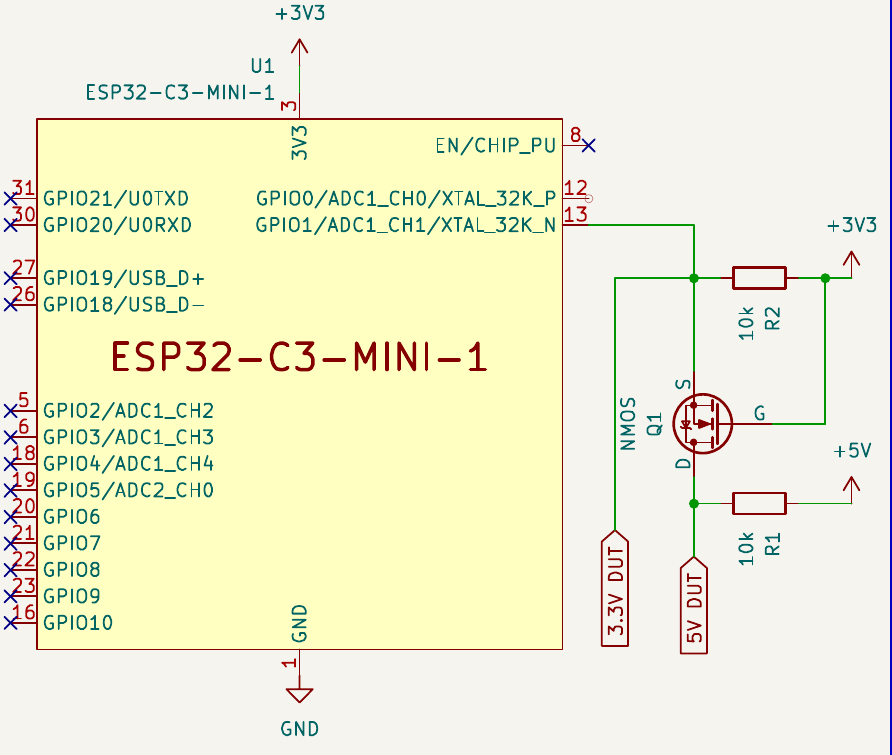

# DCP-validator

This is the project of a device used to validate devices that use the [DCP](https://github.com/Durkh/DCP) protocol. It tests a target device against a table of parameters and present the results in a web page, as well as presenting possible failure reasons.

It can also be used as a development tool, as it'll give some hints to what isn't properly working.

# Tests

Currently, this project tests:

- Specification Conformity (physical layer)
    - Speed class;
    - Signal timings;
    - Bus yield.
- Transmission Information (Network layer)
    - Transmission type;
    - Mandatory signals presence;
    - L3 structure conformity.
- Electrical Information
    - High and Low voltages;
    - Bus rise time;
    - Bus fall time;
    - Bus cycle time;
    - Bus Max speed;

# Hardware

This project uses an ESP32-C3 with an optional NMOS for level shifting to 5V devices. Future implementations may use optocouplers.

---

# Usage

Upon first activation, the device will host a wi-fi network and create a web endpoint in http://dcp-validator.info and ask if the user want to add the device to a local wi-fi network, prompting wi-fi info, or do the tests without it. After being added to the network, the device will disable its wi-fi network and rely on the local network until either the impossibility to connect to the AP (for whatever reason) or being asked to forget the network. **[WIP]**

When in the test page, add the DUT (Device Under Test) DCP protocols and begin the test in the button on the bottom of the page. The device will then perform the tests sequentially and present the results. The page can be downloaded as PDF for archival.
